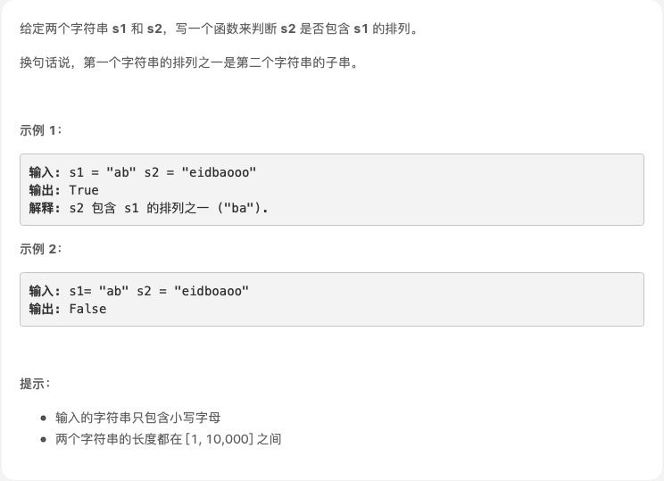

# [字符串排列](https://leetcode-cn.com/explore/featured/card/bytedance/242/string/1016/)



## 思路

暴力检查。
s1 或 s2 为空字符串,返回 false

首先如果 s1 的长度大于 s2 的长度,返回 false

```js
/**
 * @param {string} s1
 * @param {string} s2
 * @return {boolean}
 */
var checkInclusion = function (s1, s2) {
  if (s1 == '' || s2 == '') return false
  let len1 = s1.length,
    len2 = s2.length
  if (len1 > len2) return false
  for (let i = 0; i <= len2 - len1; i++) {
    let subStr2 = s2.substr(i, len1)
    if (checkStr(s1, subStr2)) {
      return true
    }
  }
  return false
}
function checkStr(s1, s2) {
  let tems1 = s1.split('').sort().join('')
  let tems2 = s2.split('').sort().join('')
  if (tems1 == tems2) {
    return true
  }
  return false
}

let s1 = 'ab',
  s2 = 'eidbaooo'

let res = checkInclusion(s1, s2)

console.log('res:', res)
```

一提交，超过时间限制

我是脑残：直接看官方解答吧

https://leetcode-cn.com/problems/permutation-in-string/solution/zi-fu-chuan-de-pai-lie-by-leetcode-solut-7k7u/

滑动窗口

```js
var checkInclusion = function (s1, s2) {
  const n = s1.length,
    m = s2.length
  if (n > m) {
    return false
  }
  const cnt1 = new Array(26).fill(0)
  const cnt2 = new Array(26).fill(0)
  for (let i = 0; i < n; ++i) {
    ++cnt1[s1[i].charCodeAt() - 'a'.charCodeAt()]
    ++cnt2[s2[i].charCodeAt() - 'a'.charCodeAt()]
  }
  if (cnt1.toString() === cnt2.toString()) {
    return true
  }
  for (let i = n; i < m; ++i) {
    ++cnt2[s2[i].charCodeAt() - 'a'.charCodeAt()]
    --cnt2[s2[i - n].charCodeAt() - 'a'.charCodeAt()]
    if (cnt1.toString() === cnt2.toString()) {
      return true
    }
  }
  return false
}
```

后续还有优化，具体看上面链接
