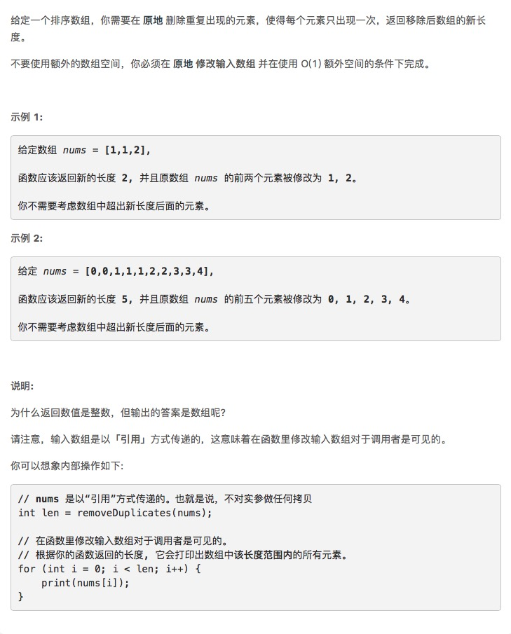

# [数组删除重复项](https://leetcode-cn.com/problems/remove-duplicates-from-sorted-array/)



## 思路

## 自己写的

```js
/**
 * @param {number[]} nums
 * @return {number}
 */
var removeDuplicates = function(nums) {
    for(var i = 0; i < nums.length-1; i++){
         for(var j = i+1; j < nums.length; j++){
            if(nums[i]==nums[j]){
              nums.splice(j,1);//console.log(nums[j]);
               j--;
           }
        }
    } 
    return nums.length;
};
```

## 官方解

 * 时间复杂度：O(n)
 * 空间复杂度：O(1)

```java
public int removeDuplicates(int[] nums) {
    if (nums.length == 0) return 0;
    int i = 0;
    for (int j = 1; j < nums.length; j++) {
        if (nums[j] != nums[i]) nums[++i] = nums[j];
    }
    return ++i;
}
```

```c++
int removeDuplicates(vector<int>& nums) {
    if (nums.size() < 2) return nums.size();
    int i = 0;
    for (int j = 1; j < nums.size(); j++)
        if (nums[j] != nums[i]) nums[++i] = nums[j];
    return ++i;
}
```
