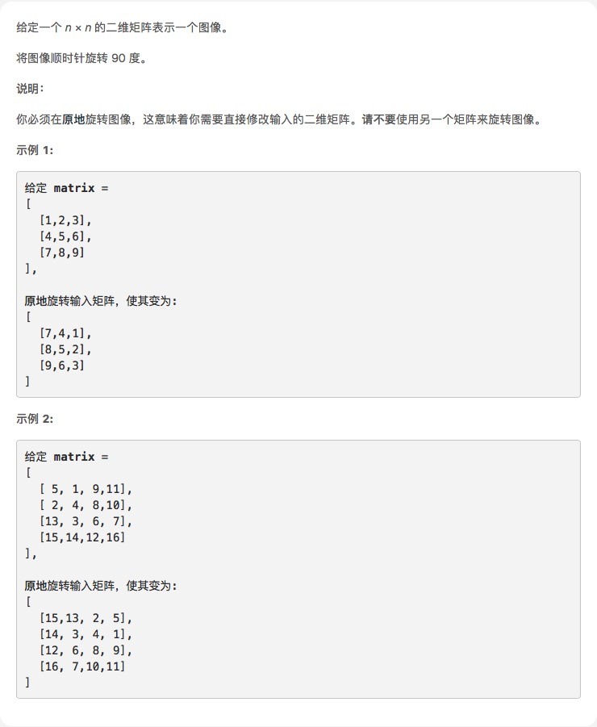

# [旋转图像](https://leetcode-cn.com/explore/interview/card/top-interview-questions-easy/1/array/31/)



## 思路

首先看到题目一开始我是懵逼的，只能像做逻辑题，试试找一下规律。

发现把每个原数组的第一个元素出来，形成一个新的数组，作为结果数组的第一项，每个原数组的第二个元素取出来，变成结果数组的第二项...那就比较简单
了，直接写个方法遍历操作数组就行了。

如下第一个方案，但是用了局部变量，没有原地，不符合题目。方案二类似，我是打算在原数组后面再加两个空数组，其实也不符合题意的原地旋转

后面方案3和4，转置再翻转，或者翻转再转置一致，就是元素交换位置。`[i][j]`和`[j][i]`交换,然后发现再reverse一下就好了。

所以对于二维数组，**转置**一下有奇效！


方法5，答案里的方案。稍微难理解一些

1. 借用局部对象，不符合题目要求
```js
  var rotate = function (matrix) {
    var n = matrix.length;
    var temp_arr = []
    for (var i = 0; i < n; i++) {
        var line = []
        for (var j = 0; j < n; j++) {
            line.unshift(matrix[j][i]);
        }
        console.log(line);
        temp_arr.push(line);
    }

    return temp_arr
};
```
2. 利用原数组，本地测可以。
```js
var rotate = function (matrix) {
    var n = matrix.length;
    for (var i = 0; i < n; i++) {
        matrix[2 * n - i - 1] = []; //定义一个行数组
        for (var j = 0; j < n; j++) {
            matrix[2 * n - i - 1].unshift(matrix[j][n - i - 1]);
        }
    }
   matrix.splice(n)
    // console.log(matrix)
    return matrix;
};
```

3. 转置，然后再翻转一下

```js
var rotate = function (matrix) {
    for (var i = 0; i < matrix.length; i++) {
        for (var j = i + 1; j < matrix.length; j++) {
            var temp = matrix[i][j];
            matrix[i][j] = matrix[j][i]
            matrix[j][i] = temp
        }
    }

    for (var i = 0; i < matrix.length; i++) {
        matrix[i].reverse()
    }
};
```
4. 整个翻转，再转置
```js
var rotate = function(matrix) {
    matrix.reverse() //[[1],[2],[3]] => [[3],[2],[1]]
    for(var i=0;i<matrix.length;i++){
        for(var j=i+1;j<matrix.length;j++){
            var temp = matrix[i][j];
            matrix[i][j] = matrix[j][i]
            matrix[j][i] = temp
        }
    }
};
```
5. 方法三 !

把矩阵看为一层一层的，由外层到内层，这是外循环。每一层看成四个小的块交换位置，这是内循环。

```js
var rotate = function(matrix) {
    var len = matrix.length;
    //循环几层
    for(var i=0;i<len/2;i++){
        //每层要移动的小数组的宽度循环
        for(var j=i;j<len-1-i;j++){
            var temp = matrix[i][j]
            matrix[i][j] = matrix[len-1-j][i]
            matrix[len-1-j][i] = matrix[len-1-i][len-1-j]
            matrix[len-1-i][len-1-j] = matrix[j][len-1-i]
            matrix[j][len-1-i] = temp;
        }
    }

};
```