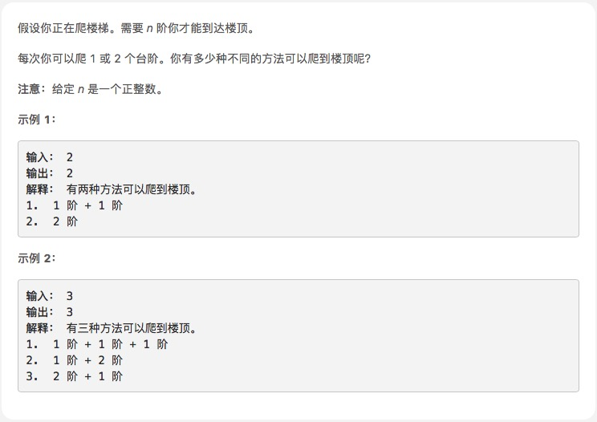

# [爬楼梯](https://leetcode-cn.com/explore/interview/card/top-interview-questions-easy/23/dynamic-programming/54/)



```js
var climbStairs = function (n) {
    var results = [];
    for (var i = 0; i < n; i++) {
        if (i < 2) {
            results[i] = i + 1
        } else {
            results[i] = results[i - 1] + results[i - 2]
        }
    }
    return results[n - 1]
};
```