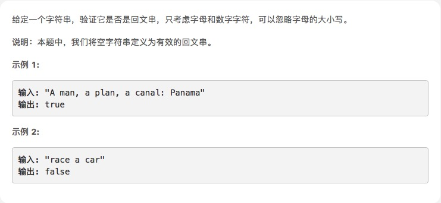

# [回文字符串](https://leetcode-cn.com/explore/interview/card/top-interview-questions-easy/5/strings/36/)



## 思路

忽略大小写，就先转成小写。然后正则去掉非字母和数字的字符，然后转成数组reverse，再转成字符串比较

```js
var isPalindrome = function (s) {
    s = s.toLowerCase()
    s = s.replace(/[^a-z0-9]/g, "")
    if (s.split("").reverse().join("") == s) {
        return true;
    } else {
        return false;
    }
};
```