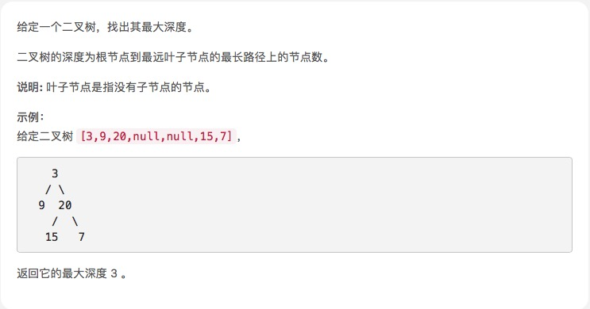

# [二叉树的最大深度](https://leetcode-cn.com/explore/interview/card/top-interview-questions-easy/7/trees/47/)



## 思路


```js
/**
 * Definition for a binary tree node.
 * function TreeNode(val) {
 *     this.val = val;
 *     this.left = this.right = null;
 * }
 */
/**
 * @param {TreeNode} root
 * @return {number}
 */
var maxDepth = function (root) {
    if (root === null) { //注意等号
        return 0;
    } else {
        var leftDepth = maxDepth(root.left),
            rightDepth = maxDepth(root.right);

        var childDepth = leftDepth > rightDepth ? leftDepth : rightDepth;

        return childDepth + 1;//根节点不为空高度至少为1
    }
};


```