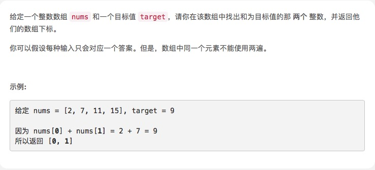

# [两数之和](https://leetcode-cn.com/problems/two-sum/)



## 思路

第一种是暴力遍历。

第二种比较巧的方式，就是使用hashTable。js里没有hashTable，所以可以用数组来达到同样作用。

首先遍历一开始，`var temp = target -nums[i];`,a[temp]肯定是undefined，a[nums[i]] = i,这里把对应值位置存储当前的index。

然后后面temp找到的时候，就是之前a[temp]就是之前存储的位置

举个例子：

数组第一个元素是4，第7个元素是5，然后和是9。

遍历开始,i=0,temp = 9-4 =5,`a[5]`是undefined。所以存储`a[4]` = 0。

到i=6的时候,temp = 9-5 = 4 ,`a[4]`是0，就是之前的存储的值，所以返回`[a[temp],i]`

## 暴力遍历

```js
/**
 * @param {number[]} nums
 * @param {number} target
 * @return {number[]}
 */
var twoSum = function(nums, target) {
    if(nums.length == 0) return [];
    for(var i =0;i<nums.length-1;i++){
        for(var j =i+1;j<nums.length;j++){
            if(nums[i]+nums[j] == target){
                return [i,j]
            }
        }
    }
    return [];
};
```

```js
function twosum(nums,target){
  var a =[];
  for(var i=0,len= nums.length;i<len;i++){
    var temp = target -nums[i];
    if(a[temp]!== undefined) return [a[temp],i];
    a[nums[i]] = i;
  }
  
}

var arr = [1,3,4,5,7,8,10,11];
var res = twosum(arr,10);
console.log(res)
```
