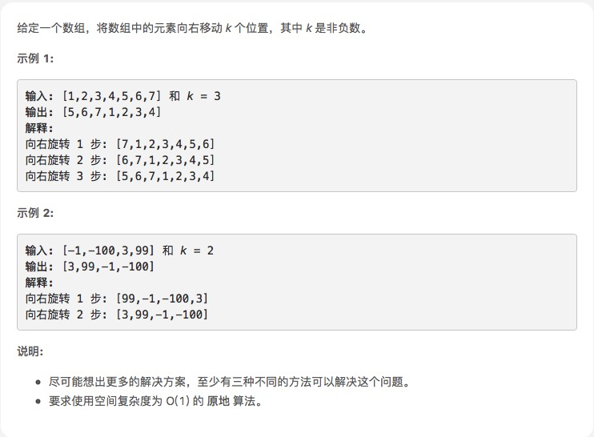

# [旋转数组](https://leetcode-cn.com/explore/interview/card/top-interview-questions-easy/1/array/23/)



## 思路

首先空数组判断

然后k次循环，从数组最后面pop出元素，塞到数组前面就可以了

熟悉pop和unshift用法

```js
var rotate = function (nums, k) {
    if (nums.length == 0) return [];
    for (var i = 0; i < k; i++) {
        var last = nums.pop();
        nums.unshift(last)
    }
};
```
