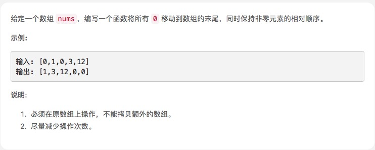

# [移动零](https://leetcode-cn.com/explore/interview/card/top-interview-questions-easy/1/array/28/)



## 思路

比较简单，就是把0取出来，然后放到数组后面

开始写的，没通过，可能不支持filter吧
```js
var moveZeroes = function(nums) {
 return nums.filter(a => a != 0).concat(nums.filter(a => a == 0))
};
```
然后重写一个，加个变量计数通过了
```js
var moveZeroes = function (nums) {
    var count = 0
    for (var i = 0; i < nums.length; i++) {
        if (nums[i] == 0) {
            nums.splice(i, 1);
            i--
            count++
        }
    }
    for (var j = 0; j < count; j++) {
        nums.push(0)
    }
    return nums
};
```
