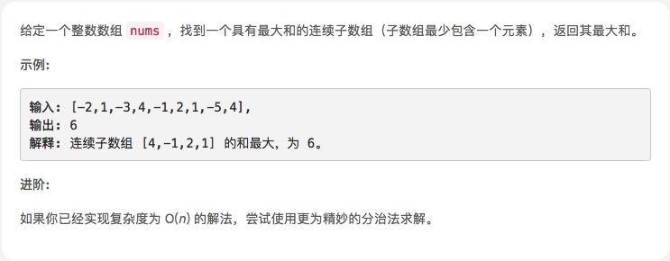
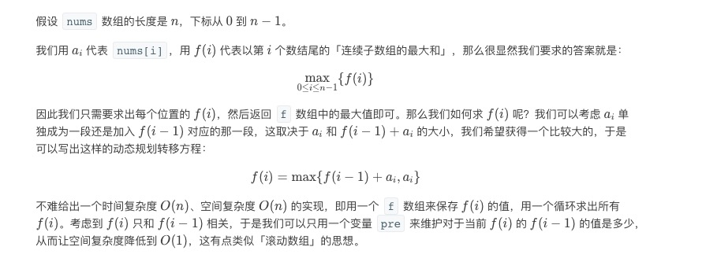

# [最大子序和](https://leetcode-cn.com/explore/interview/card/top-interview-questions-easy/23/dynamic-programming/56/)



## 思路

### 1. 暴力枚举

```js
var maxSubArray = function (nums) {
    var sum = -Infinity;
    var len = nums.length;
    for (var start = 0; start < len; start++) {
        for (var end = start + 1; end < len; end++) {
            var temp = nums.slice(start, end);
            var ans = temp.reduce(function (prev, curr) {
                return prev + curr;
            });
            if (sum < ans) {
                sum = ans;
            }

        }
    }
    return sum
};
```
优化

```js
var maxSubArray = function (nums) {
    var sum = -Infinity;
    var len = nums.length;
    for (var start = 0; start < len; start++) {
        var ans = 0
        for (var end = start; end < len; end++) {

            ans = ans + nums[end];
            if (sum < ans) {
                sum = ans;
            }
        }
    }
    return sum
};
```

### 2. 贪心算法

    * 若当前指针所指元素之前的和小于0，则丢弃当前元素之前的数列

```js
var maxSubArray = function (nums) {
    var len = nums.length;
    var cur_sum = nums[0], max_sum = nums[0];
    for (var i = 0; i < len; i++) {
        cur_sum = Math.max(nums[i], cur_sum + nums[i]); //若当前指针所指元素之前的和小于0，则丢弃当前元素之前的数列
        max_sum = Math.max(cur_sum, max_sum)
    }
    return max_sum;
}
```


### 3. 动态规划

    * 若前一个元素大于0，则将其加到当前元素上

```js
var maxSubArray = function(nums) {
    let len = nums.length
    for(var i=1;i<len;i++){
        if(nums[i-1]>0){
            nums[i]+=nums[i-1]
        }
    }
    return Math.max(...nums)
};
```



```js
var maxSubArray = function(nums) {
    let pre = 0, maxAns = nums[0];
    nums.forEach((x) => {
        pre = Math.max(pre + x, x);
        maxAns = Math.max(maxAns, pre);
    });
    return maxAns;
};
```


### 4. 分治

[题解](https://leetcode-cn.com/problems/maximum-subarray/solution/zui-da-zi-xu-he-by-leetcode-solution/)

繁琐 ￣□￣｜｜