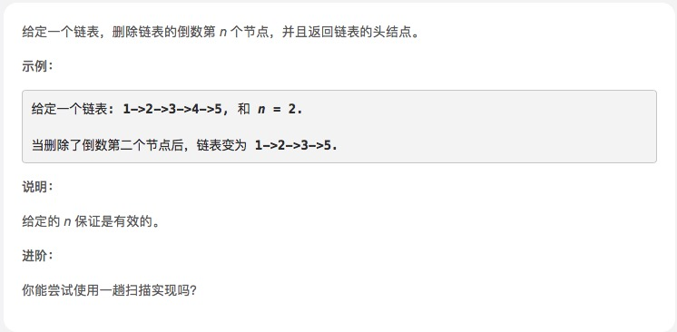

# [删除链表的倒数第N个节点](https://leetcode-cn.com/explore/interview/card/top-interview-questions-easy/6/linked-list/42/)



## 思路

两个游标，一个first,一个second。都指向头结点

先把first往后移动N个节点。

如果first为null,就是到尾部了，所以删除的是头结点。(题目里保证n是有效的，也就是说不会超过链表长度)

first还有后续节点，就让second和first一起往后移动，直到first到链表末尾。这是second.next就是要删除的倒数第N个节点了

 second.next = second.next.next删除掉，返回头节点

 

```js
/**
 * Definition for singly-linked list.
 * function ListNode(val) {
 *     this.val = val;
 *     this.next = null;
 * }
 */
/**
 * @param {ListNode} head
 * @param {number} n
 * @return {ListNode}
 */
var removeNthFromEnd = function (head, n) {
    let first = head, second = head;
    while (n > 0) {
        first = first.next
        n--
    }
    if (!first) return head.next;     // 删除的是头节点
    while (first.next) {
        first = first.next;
        second = second.next;
    }
    second.next = second.next.next;
    return head
};

```