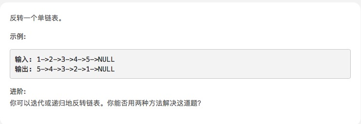
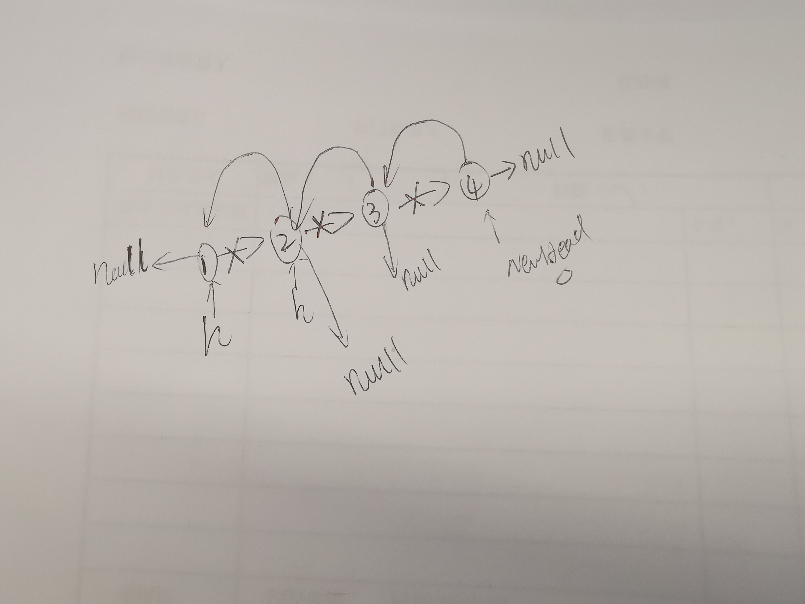

# [反转链表](https://leetcode-cn.com/explore/interview/card/top-interview-questions-easy/6/linked-list/43/)




1. 迭代方案

```js
var reverseList = function (head) {
    let node = head,
        previous = null,
        tmp = null;

    while (node) {
        // save next before we overwrite node.next!
        tmp = node.next;

        // reverse pointer
        node.next = previous;

        // step forward in the list
        previous = node;
        node = tmp;
    }

    return previous;
};

```
2. 递归方案

如下图，我一开始在纠结head.next = null这一句，我想不是只有末尾置成null了吗，怎么会每一个节点的指向都置为null。

其实是被递归绕进去了，最后会先执行栈顶的函数。所以当开始节点head3.next被置为null，

到head2节点，head2.next.next(也就是head3.next)再次被置为head2。最后只有头部节点的next指向null



```js
var reverseList = function (head) {
    if(head == null || head.next == null) return head;
    var newHead = reverseList(head.next);
	head.next.next = head; 
	head.next = null;
	return newHead; 
};
```