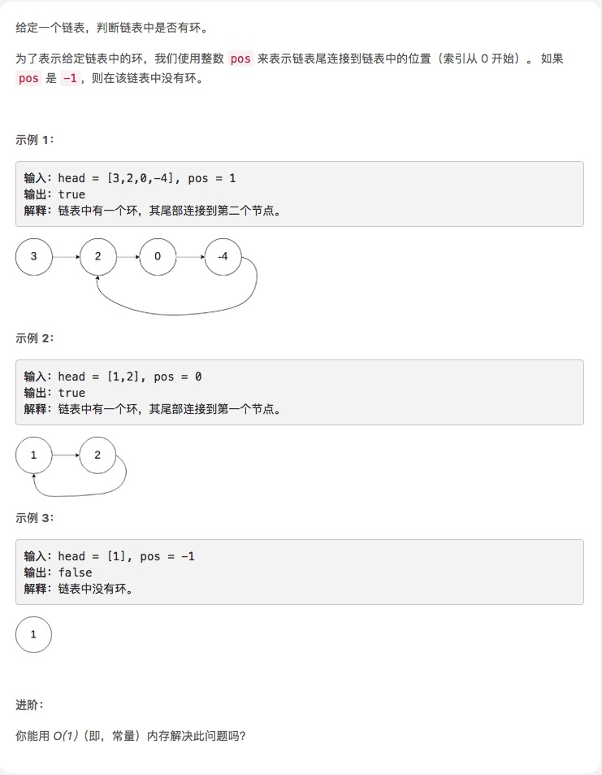

# [环形链表](https://leetcode-cn.com/explore/interview/card/top-interview-questions-easy/6/linked-list/46/)



## 思路

p1,p2两个游标，p2每次两步，如果有环，p2肯定早晚会遇到p1。如果没有，p2走到结尾，结束。

```js
/**
 * Definition for singly-linked list.
 * function ListNode(val) {
 *     this.val = val;
 *     this.next = null;
 * }
 */

/**
 * @param {ListNode} head
 * @return {boolean}
 */
var hasCycle = function(head) {
    if (!head || !head.next) return false
  let p1 = head,
      p2 = head.next;
  while (p2 && p2.next) {
    if (p1 === p2) return true;
    p1 = p1.next;
    p2 = p2.next.next;
  }
  return false;
};
```