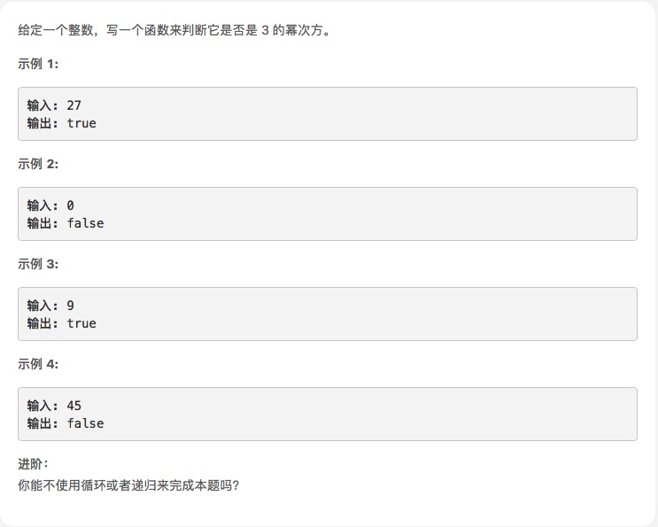

# [3的幂](https://leetcode-cn.com/explore/interview/card/top-interview-questions-easy/25/math/62/)



## 题解

### 1. 暴力检查

就是不停地除以3，最后检查是否等于1呗

开始写错了，忘了1也是3的幂。

```js
var isPowerOfThree = function (n) {
    if (n<1) return false;
    while (n % 3 == 0) {
       n = n/3
    }
    return n == 1;
};
```

### 其他方法

