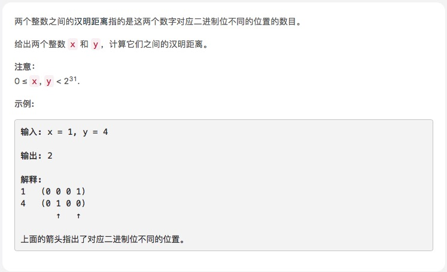

# [汉明距离](https://leetcode-cn.com/explore/interview/card/top-interview-questions-easy/26/others/65/)



## 思路

异或，然后算下 1 的个数

```js
var hammingDistance = function (x, y) {
  var s = x ^ y
  var c = 0
  for (var i = 0; i < 32; i++) {
    if (s & (1 == 1)) {
      c++
    }
    s = s >> 1
  }
  return c
}
```
