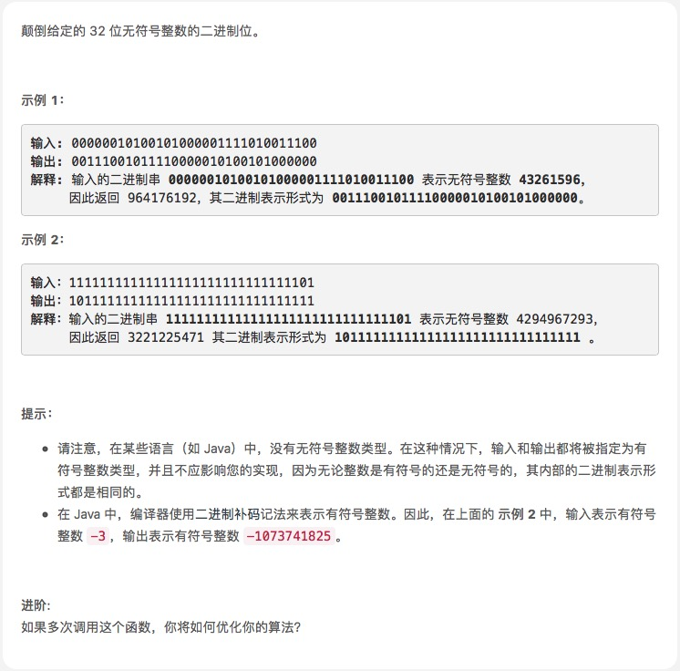

# [颠倒二进制位](https://leetcode-cn.com/explore/interview/card/top-interview-questions-easy/26/others/66/)



```js
var reverseBits = function (n) {
  var str = Number(n).toString(2)
  str = str.padStart(32, 0)
  // console.log('str',str)
  reverseStr = str.split('').reverse().join('')
  // console.log('reverseStr',reverseStr)
  return parseInt(reverseStr, 2)
}
```

```js
var reverseBits = function (n) {
  let rev = 0
  for (let i = 0; i < 32 && n > 0; ++i) {
    rev |= (n & 1) << (31 - i)
    n >>>= 1
  }
  return rev >>> 0
}
```

分智算法，我还没看懂，有时间研究

```js
var reverseBits = function (n) {
  const M1 = 0x55555555 // 01010101010101010101010101010101
  const M2 = 0x33333333 // 00110011001100110011001100110011
  const M4 = 0x0f0f0f0f // 00001111000011110000111100001111
  const M8 = 0x00ff00ff // 00000000111111110000000011111111

  n = ((n >>> 1) & M1) | ((n & M1) << 1)
  n = ((n >>> 2) & M2) | ((n & M2) << 2)
  n = ((n >>> 4) & M4) | ((n & M4) << 4)
  n = ((n >>> 8) & M8) | ((n & M8) << 8)
  return ((n >>> 16) | (n << 16)) >>> 0
}
```
