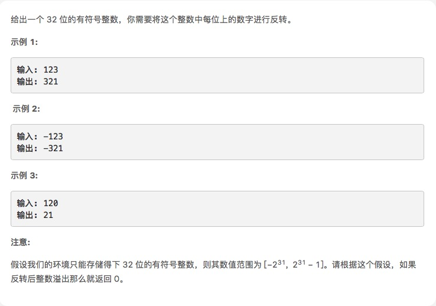

# [整数反转](https://leetcode-cn.com/explore/interview/card/top-interview-questions-easy/5/strings/33)



## 思路

题目不难，主要是细节

1. 先取符号 采用es6 Math.sign 符号函数， 正数返回 1 ，负数返回 -1 (如果不用这个方法，就判断下第一个字符是不是'-')
2. 绝对值-> 转字符串 -> 字符串转数组 -> 反转数组 -> 字符串 -> 上符号 -> 判断范围

自己写的,调试过几次，注意细节
```js
var reverse = function(x) {
    let sign = Math.sign(x)
    let res = (Math.abs(x) + '').split('').reverse().join('') * sign
    if (res > Math.pow(2, 31) - 1 || res < Math.pow(2, 31) * -1) res = 0
    return res
};
```