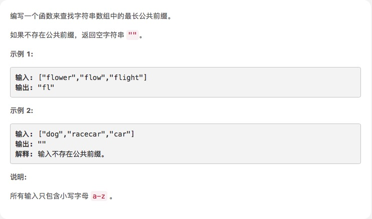

# [最长公共前缀](https://leetcode-cn.com/explore/interview/card/top-interview-questions-easy/5/strings/40/)



## 思路

思路很简单，用第一个元素来试，首先第一个元素取一个字符(判断字符)，如果后面有元素判断不包含，则跳出两层循环。同时之前的判断字符多了一位，后面要记得截取掉。

自己写的
```js
var longestCommonPrefix = function (strs) {
    if (strs.length == 0 || strs[0].length == 0) return "";
    if (strs.length == 1) return strs[0];
    var index = 1, breaked = false;
    outer:
    while (index <= strs[0].length) {
        inter:
        var testStr = strs[0].substring(0, index)
        for (var i = 0, len = strs.length; i < len; i++) {
            var item = strs[i];
            if (item.indexOf(testStr) < 0) {
                 breaked = true
                break outer;
            } 
        }
        index++;

    }
    var strlen = testStr.length
    return breaked ? testStr.substring(0, strlen - 1) : testStr; //截掉最后一位
}

var src = ["c", "acc", "ccc"]
var res = longestCommonPrefix(src);
console.log(res)
```