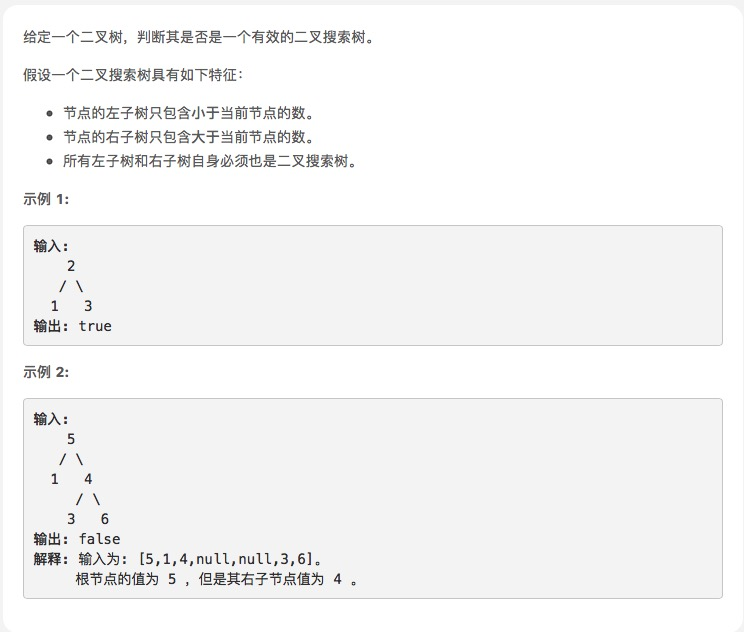

# [验证二叉搜索树](https://leetcode-cn.com/explore/interview/card/top-interview-questions-easy/7/trees/48/)



```js
/**
 * Definition for a binary tree node.
 * function TreeNode(val) {
 *     this.val = val;
 *     this.left = this.right = null;
 * }
 */
/**
 * @param {TreeNode} root
 * @return {boolean}
 */
var isValidBST = function (root) {
    let max = Infinity, min = -Infinity;
    function judge(node, max, min) {
        if (node == null) return true;
        if (node.val < max && node.val > min) {
            return judge(node.left, node.val, min) && judge(node.right, max, node.val);
        }
        return false;
    }
    return judge(root, max, min);
};
```