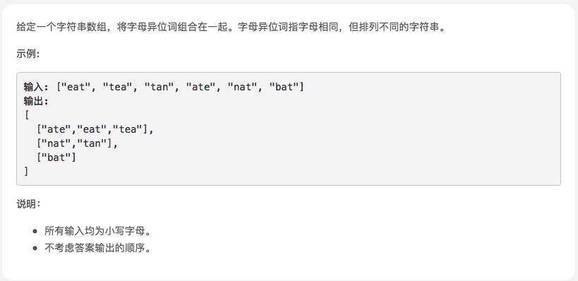

# [字母异位词分组](https://leetcode-cn.com/problems/group-anagrams/solution/js-xie-leetcode-by-zhl1232-3/)



## 思路

那先写个方法验证字母异位词。然后无非写方法遍历分组。主要就是加个变量判断是否已经分组了，没有就新建一个组

```js
var groupAnagrams = function (strs) {
    var ans = [[strs[0]]]; //先放一个元素
    var len = strs.length;
    var hasGrouped = false
    for (var i = 1; i < len; i++) {
        var item = strs[i]
        hasGrouped = false;
        ans.forEach(arrItem => {  //每一个组
            if (isAnagrams(arrItem[0], item)) {  //只需要取第一个元素判断下
                arrItem.push(item);
                hasGrouped = true;
            }
        })
        if (!hasGrouped) {  //如果都没有的话
            var newArr = [item];
            ans.push(newArr)
        }

    }

    return ans;
};

var isAnagrams = function (s1, s2) {
    var s1Tem = s1.split("").sort().join("")
    var s2Tem = s2.split("").sort().join("")
    return s1Tem == s2Tem
}
```

好了，一提交 超出时间限制。￣□￣｜｜

看了下题解，其实原理差不多，不过用了个Map。map底层原理不是完整遍历，使用了链表，不是O(n^2)


O(nklogk) ,k是strs中字符串的最大长度。O(n)是外层循环，然后在O(klogk)时间内对每个字符串排序。

```js
/**
 * @param {string[]} strs
 * @return {string[][]}
 */
var groupAnagrams = function(strs) {
    let hash = new Map()
    
    for(let i = 0; i < strs.length; i++) {
        let str = strs[i].split('').sort().join()
        if(hash.has(str)) {
            let temp = hash.get(str)
            temp.push(strs[i])
            hash.set(str, temp)
        } else {
            hash.set(str, [strs[i]])
        }
    }
    
    return [...hash.values()]
};
```

还有其他比较巧的方法，详见[题解](https://leetcode-cn.com/problems/group-anagrams/solution/js-xie-leetcode-by-zhl1232-3/)