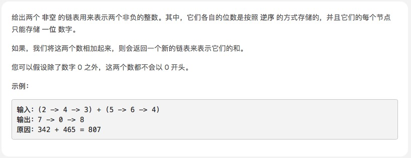

# 两数相加



## 思路

* 标签：链表
* 将两个链表看成是相同长度的进行遍历，如果一个链表较短则在前面补 
0，比如 987 + 23 = 987 + 023 = 1010
* 每一位计算的同时需要考虑上一位的进位问题，而当前位计算结束后同样需要更新进位值
* 如果两个链表全部遍历完毕后，进位值为 
1，则在新链表最前方添加节点1
* 小技巧：对于链表问题，返回结果为头结点时，通常需要先初始化一个预先指针 pre，该指针的下一个节点指向真正的头结点head。使用预先指针的目的在于链表初始化时无可用节点值，而且链表构造过程需要指针移动，进而会导致头指针丢失，无法返回结果。

```js
 /**
 * Definition for singly-linked list.
 * function ListNode(val) {
 *     this.val = val;
 *     this.next = null;
 * }
 */
/**
 * @param {ListNode} l1
 * @param {ListNode} l2
 * @return {ListNode}
 */
var addTwoNumbers = function(l1, l2) {
    let node = new ListNode('head');
    let temp = node;//哑结点
    let add = 0;//是否进一
    let sum = 0;//新链表当前未取余的值 = 链表1值 + 链表2值 + add;

    //遍历，直到最长的都为空
    while(l1 || l2){
        sum = (l1 ? l1.val : 0) + (l2 ? l2.val : 0) + add;
        temp.next = new ListNode(sum % 10);//取余则为新链表的值
        temp = temp.next;
        add = sum >= 10 ? 1 : 0;
        l1 && (l1 = l1.next);
        l2 && (l2 = l2.next);
    }
    add && (temp.next = new ListNode(add));
    return node.next;
};

```