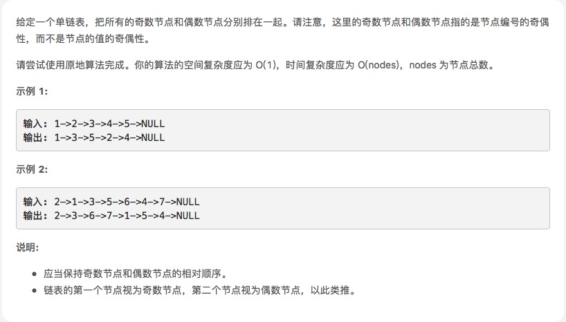

# [奇偶链表]()



 ## 思路

这个解法非常符合直觉思路也很简单。但是要写一个精确且没有 bug 的代码还是需要进行一番思索的。

一个 LinkedList 需要一个头指针和一个尾指针来支持双端操作。我们用变量 head 和 odd 保存奇链表的头和尾指针。

evenHead 和 even 保存偶链表的头和尾指针。算法会遍历原链表一次并把奇节点放到奇链表里去、偶节点放到偶链表里去。
 
遍历整个链表我们至少需要一个指针作为迭代器。这里 odd 指针和 even 指针不仅仅是尾指针，也可以扮演原链表迭代器的角色。


```js

   var oddEvenList = function(head) {
        if (head == null) return null;
        var odd = head, even = head.next, evenHead = even;
        while (even != null && even.next != null) {
            odd.next = even.next;
            odd = odd.next;
            even.next = odd.next;
            even = even.next;
        }
        odd.next = evenHead;
        return head;
    }


```