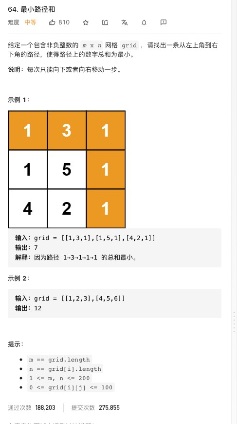

# 题集

## [最小路径和](https://leetcode-cn.com/problems/minimum-path-sum/)



### 思路

核心思路：

1. DP 方程

   当前项最小路径和 = 当前项值 + 上项或左项中的最小值
   grid[i][j] += Math.min( grid[i - 1][j], grid[i][j - 1] )

2. 边界处理

   grid 的第一行与第一列 分别没有上项与左项 故单独处理计算起项最小路径和
   计算第一行

```js
for (let j = 1; j < col; j++) grid[0][j] += grid[0][j - 1]
```

计算第一列

```js
for (let i = 1; i < row; i++) grid[i][0] += grid[i - 1][0]
```

```js
/**
 * @param {number[][]} grid
 * @return {number}
 */
var minPathSum = function (grid) {
  let row = grid.length,
    col = grid[0].length

  // calc boundary
  for (let i = 1; i < row; i++)
    // calc first col
    grid[i][0] += grid[i - 1][0]

  for (let j = 1; j < col; j++)
    // calc first row
    grid[0][j] += grid[0][j - 1]

  for (let i = 1; i < row; i++) for (let j = 1; j < col; j++) grid[i][j] += Math.min(grid[i - 1][j], grid[i][j - 1])

  return grid[row - 1][col - 1]
}
```

## 大数相加

```js
let a = '9007199254740991'
let b = '1234567899999999999'

function add(a, b) {
  //取两个数字的最大长度
  let maxLength = Math.max(a.length, b.length)
  //用0去补齐长度
  a = a.padStart(maxLength, 0) //"0009007199254740991"
  b = b.padStart(maxLength, 0) //"1234567899999999999"
  //定义加法过程中需要用到的变量
  let t = 0
  let f = 0 //"进位"
  let sum = ''
  for (let i = maxLength - 1; i >= 0; i--) {
    t = parseInt(a[i]) + parseInt(b[i]) + f
    f = Math.floor(t / 10)
    sum = (t % 10) + sum
  }
  if (f == 1) {
    sum = '1' + sum
  }
  return sum
}
```

### 买股票最佳时机

##### 只能交易一次的

1. 暴力解决

```js
var maxProfit = function (prices) {
  var maxprofit = 0
  for (var i = 0; i < prices.length; i++) {
    for (var j = i + 1; j < prices.length; j++) {
      var profit = prices[j] - prices[i]
      if (profit > maxprofit) maxprofit = profit
    }
  }
  return maxprofit
}
```

只关心 i 前面元素里最小的 minprice 是多少，然后迭代当前 price[i] - minprice 得到最大值

```js
let maxProfit = function (prices) {
  let max = 0,
    minprice = prices[0]
  for (let i = 1; i < prices.length; i++) {
    minprice = Math.min(prices[i], minprice)
    max = Math.max(max, prices[i] - minprice)
  }
  return max
}
```

#### 可交易多次的

```js
var maxProfit = function (prices) {
  let money = 0
  let buy = prices[0]
  for (let price of prices) {
    if (price > buy) {
      money += price - buy
    }
    buy = price
  }
  return money
}
```

### 数组题

[1,1,3,3,2,2,4] 找出重复的数字

https://johnzhu12.github.io/easy/Array/只出现一次的数字.html

[0,0,0,1,1,1,2,2,3,3,4] 找出不重复的数字有多少个，并把数组前 N 项改成不重复的数字

```js
var findSignle = function (arr) {
  var len = arr.length,
    sum = 0
  if (!arr || len == 0) return 0
  var sum = 0
  var numMap = {}
  for (var i = 0; i < len; i++) {
    //有重复
    if (numMap[arr[i]] !== undefined) {
      numMap[arr[i]]++
    } else {
      //没有重复
      numMap[arr[i]] = 1
    }
  }
  for (var key in numMap) {
    if (numMap[key] == 1) {
      arr[sum] = key
      sum++
    }
  }
  //把数组前N个改成不重复的数字
  console.log(arr)
  return sum
}
var src = [0, 0, 0, 1, 1, 1, 2, 5, 2, 3, 3, 4]
var res = findSignle(src)
console.log(res)
```

### 数组分成和等值的两个数组
