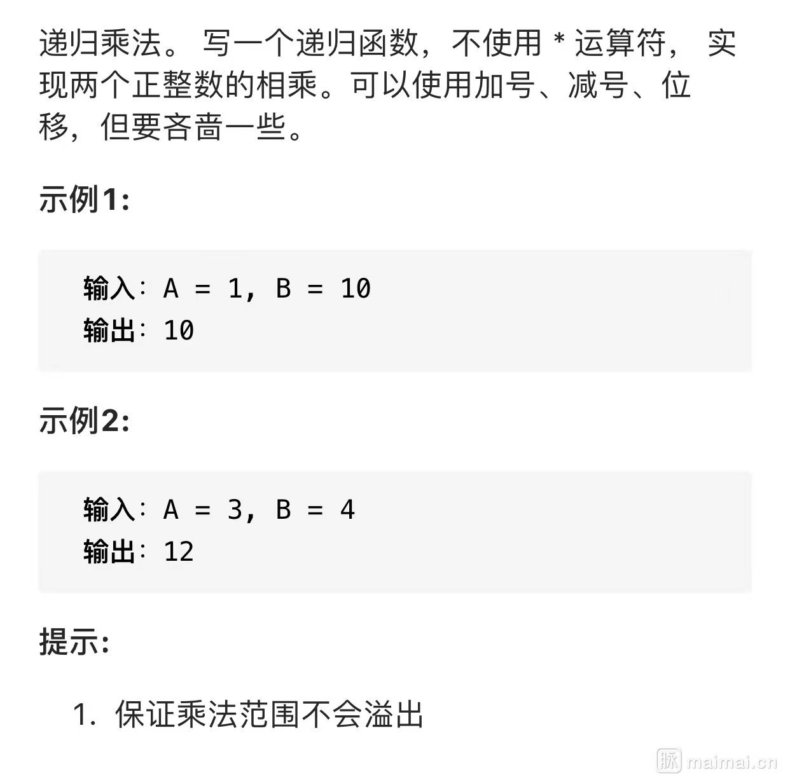

# [递归乘法]()



## 思路

1. 递归加法

A 和 B 中找到小的那个，往下递归相加

```js
/**
 * @param {number} A
 * @param {number} B
 * @return {number}
 */
var multiply = function (A, B) {
  if (A > B) {
    if (B <= 1) {
      return A
    }
    return multiply(A, B - 1) + A
  } else {
    if (A <= 1) {
      return B
    }
    return multiply(A - 1, B) + B
  }
}
```

2. 位运算

按位移动计算，<<表示左移，等同于乘以 2，>>表示右移，等同于除以 2；

递归：一直将参数 a 右移，直到 a<=2 为止；同时参数 b 左移；一参数左移，一参数右移，相互抵消；

如果参数 a 为奇数，右移损失精度，补加左移参数 b

```js
/**
 * @param {number} A
 * @param {number} B
 * @return {number}
 */
var multiply = function (a, b) {
  if (a === 1) {
    return b
  } else if (a === 2) {
    return b << 1
  } else {
    return a === (a >> 1) << 1 ? multiply(a >> 1, b << 1) : b + multiply(a >> 1, b << 1)
  }
}
```
