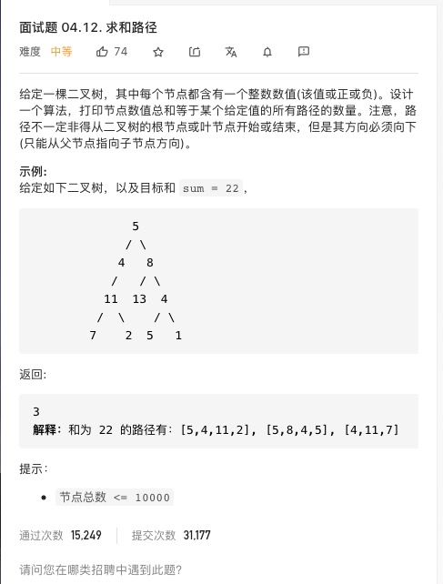

# [求和路径](https://leetcode-cn.com/problems/paths-with-sum-lcci/)



## 思路

我感觉就是回溯，试

```js
/**
 * Definition for a binary tree node.
 * function TreeNode(val) {
 *     this.val = val;
 *     this.left = this.right = null;
 * }
 */
/**
 * @param {TreeNode} root
 * @param {number} sum
 * @return {number}
 */
var pathSum = function (root, sum) {}
```
