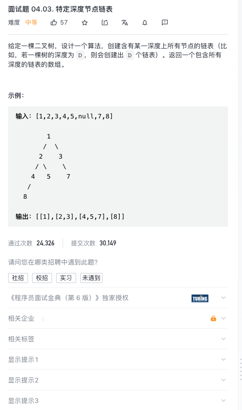

# [特定深度节点链表](https://leetcode-cn.com/problems/list-of-depth-lcci/)



## 思路

层续遍历,然后转成链表

```js
var listOfDepth = function (tree) {
  let levels = []
  if (!tree) return levels

  let helper = (node, level) => {
    if (levels.length == level) levels.push([])

    levels[level].push(node.val)

    if (node.left) helper(node.left, level + 1)
    if (node.right) helper(node.right, level + 1)
  }

  helper(tree, 0)

  //这里是层序遍历之后的代码
  levels = levels.map((arr) => {
    let len = arr.length
    let i = 0
    let head = new ListNode(0)
    let p = head
    while (i < len) {
      p.next = new ListNode(arr[i])
      p = p.next
      i++
    }
    return head.next
  })
  return levels
}
```
